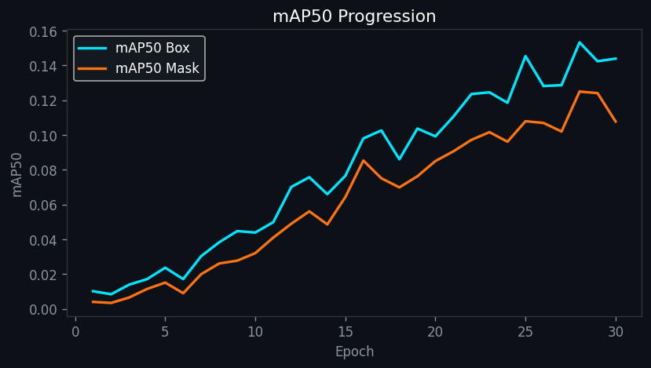
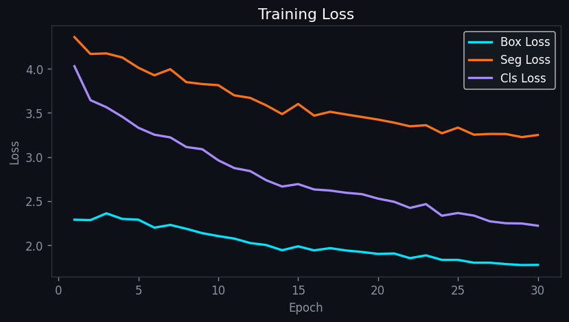
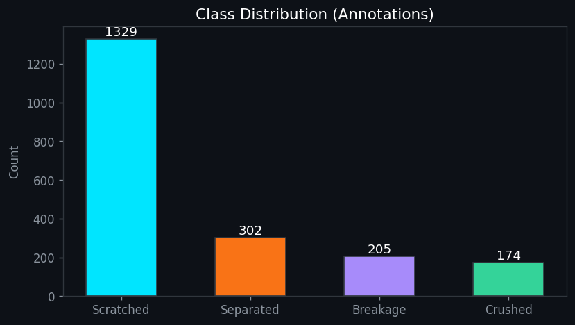

<div align="center">

# 🚗 CarCheck

**차량 손상 사진 한 장으로, AI가 "보험 처리할지 자비로 고칠지"까지 계산해 드립니다.**

사고 차량 사진을 올리면 **YOLOv8 세그멘테이션**이 손상 부위·유형을 픽셀 단위로 감지하고,
과거 수리 사례 DB로 **예상 수리비**를 추정한 뒤, 보험 할증 규정과 비교해 **보험처리 vs 자비처리**를
어느 쪽이 더 유리한지 계산해 줍니다. LLM 상담 챗봇이 근거(RAG 검색)를 붙여 결과를 설명합니다.

[]()
[]()
[]()
[]()
[]()

🚀 **[라이브 데모](https://huggingface.co/spaces/eunseok22/CarCheck)**

</div>

---

## 📌 프로젝트 정보

|  |  |
|---|---|
| **프로젝트명** | CarCheck (자동차 손상 보험 상담) |
| **개발 기간** | 2026.06.25 ~ 07.01 (개인 프로젝트) |
| **개발 인원** | 1인 — 데이터 수집·전처리부터 모델 학습, 백엔드 로직, 프론트(Streamlit) UI까지 전 과정 단독 개발 |
| **핵심 개념** | 사진 업로드 → AI 손상 탐지 → 수리비 추정 → 보험료 할증 시뮬레이션 → RAG 기반 상담/보고서 |
| **배포** | Hugging Face Spaces (Streamlit SDK) — [huggingface.co/spaces/eunseok22/CarCheck](https://huggingface.co/spaces/eunseok22/CarCheck) |

---

## ✨ 핵심 기능

| 기능 | 설명 |
|------|------|
| 🔍 **손상 탐지** | **YOLOv8n-seg** 커스텀 학습 모델로 긁힘·파손·분리·찌그러짐 4종 손상을 픽셀 세그멘테이션 + 부위(범퍼·도어·펜더·헤드라이트 등 10개 부위) 매핑, 신뢰도와 함께 마스크 오버레이 시각화 |
| 💰 **수리비 추정** | 감지된 손상 유형(긁힘→도장, 파손→교환, 찌그러짐→판금 등)을 부위별 실제 공임 데이터(SQLite)와 매칭해 항목별 예상 수리비 산출 |
| 📊 **보험 손익 계산** | 국내 자동차보험 할증 기준(50만원 미만 1년/50~150만원 2년/150만원 이상 3년, 10~15%)을 반영해 보험처리 시 향후 보험료 인상 총액과 수리비를 비교, 더 유리한 쪽을 추천 |
| 🔎 **RAG 유사 사례 검색** | ChromaDB + 다국어 임베딩(`paraphrase-multilingual-MiniLM-L12-v2`)으로 과거 수리 사례와 보험 약관·법규 문서를 검색해 답변 근거로 활용 |
| 💬 **LLM 상담 챗봇** | Groq(Llama 3.3 70B 등 다중 모델 fallback) + Gemini 비상 fallback으로 무료 API 한도 안에서도 안정적으로 응답, 분석 결과·검색된 약관을 컨텍스트로 주입 |
| 📄 **AI 상담 보고서** | 손상 분석·수리비·보험 손익을 종합해 LLM이 마크다운 리포트를 생성, LLM 응답 실패 시 규칙 기반 템플릿으로 자동 폴백 |
| 📈 **학습 모니터** | 모델 학습 곡선(mAP·loss)·클래스 분포를 Streamlit 페이지에서 바로 확인 |

---

## 🧠 모델 학습

YOLOv8n-seg를 차량 손상 데이터셋으로 파인튜닝했습니다. (`train_yolo_notebook.ipynb`, `train_colab.ipynb`)

| mAP 곡선 | Loss 곡선 | 클래스 분포 |
|:---:|:---:|:---:|
|  |  |  |

- 클래스: `Scratched(긁힘)` · `Breakage(파손)` · `Separated(분리)` · `Crushed(찌그러짐)` 4종
- 학습된 가중치(`best.pt`)는 Hugging Face Hub(`eunseok22/carcheck-model`)에 업로드해 두고, 앱 최초 구동 시 자동 다운로드하도록 구성(리포지토리에는 대용량 가중치 미포함)

---

## 🗂 아키텍처

```
사진 업로드
   │
   ▼
YOLOv8n-seg 손상 탐지 (부위 · 유형 · 신뢰도)
   │
   ├─▶ SQLite(estimates.db) 공임 조회 ──▶ 예상 수리비 산정
   │                                          │
   └─▶ 보험 할증 규칙 계산 ◀──────────────────┘
                │
                ▼
   ChromaDB RAG (유사 수리 사례 + 약관/법규 지식) 검색
                │
                ▼
   Groq LLM(다중 모델 fallback → Gemini 비상 fallback)
                │
                ▼
   상담 답변 / AI 리포트 (LLM 실패 시 템플릿 자동 폴백)
```

- 화면 전환 없이 **단일 Streamlit 앱**에서 업로드 → 분석 → 상담까지 한 흐름으로 진행
- LLM 호출은 Groq 모델을 순서대로 시도하다 모두 실패하면 Gemini로, 그마저 실패하면 **규칙 기반 리포트 템플릿**으로 자동 대체해 서비스 가용성 확보

---

## 🛠 기술 스택

| 영역 | 사용 기술 |
|------|----------|
| **프론트/앱** | Streamlit 1.40 |
| **비전 모델** | Ultralytics YOLOv8n-seg · OpenCV(headless) · Pillow |
| **LLM** | Groq API(Llama 3.3 70B / 3.1 8B / Llama3 8B / Mixtral 8x7B 순차 fallback) · Gemini 2.5 Flash(비상 fallback) |
| **RAG** | LangChain(community/core) · ChromaDB · Sentence-Transformers(다국어 임베딩) |
| **데이터** | SQLite(수리비 공임 DB) · pandas · numpy |
| **모델 배포** | Hugging Face Hub(가중치 자동 다운로드) |
| **배포** | Hugging Face Spaces |

---

## 🗃 저장소 구성

| 경로 | 설명 |
|---|---|
| `app.py` | 메인 Streamlit 앱 (업로드 → 분석 → 상담 흐름, 커스텀 CSS) |
| `pages/1_학습_모니터.py` | 모델 학습 곡선·클래스 분포 확인 페이지 |
| `services/yolo_service.py` | YOLOv8n-seg 로딩·추론·마스크 시각화, HF Hub 가중치 자동 다운로드 |
| `services/cost_service.py` | 부위·작업 유형 기반 SQLite 공임 조회 → 수리비 산정 |
| `services/insurance_service.py` | 보험 할증 규칙 계산(보험처리 vs 자비처리 손익) |
| `services/rag_service.py` | ChromaDB 유사 수리사례 / 약관·법규 지식 검색 |
| `services/llm_service.py` | Groq/Gemini 멀티 모델 LLM 호출, 상담 응답·리포트 생성 |
| `utils/` | 데이터셋 전처리·병합, RAG 인덱스 구축(`build_rag.py`, `build_knowledge_rag.py`), 수리비 DB 구축(`build_db.py`), YOLO 학습 스크립트 |
| `data/car_damage.yaml` | YOLO 학습용 데이터셋 설정 |
| `train_yolo_notebook.ipynb`, `train_colab.ipynb` | 모델 학습 노트북(로컬/Colab) |

---

## ⚡ 시작하기

```bash
git clone https://github.com/EunSeok-222/CarCheck.git
cd CarCheck
pip install -r requirements.txt

# .streamlit/secrets.toml.example 을 복사해 API 키 채우기
cp .streamlit/secrets.toml.example .streamlit/secrets.toml

streamlit run app.py
```

사용 순서: ① 차량 모델·연식 입력 → ② 연간 자동차보험료 입력 → ③ 손상 부위 사진 업로드 → ④ AI 분석 결과·처리 방법 추천 확인 → ⑤ 챗봇으로 추가 상담

## 🔑 환경 변수

| 변수 | 설명 |
|---|---|
| `GROQ_API_KEY` | Groq API 키 (1차 — LLM 상담·리포트 생성) |
| `GEMINI_API_KEY` | Gemini API 키 (2차 — Groq 실패 시 비상 fallback) |
| `HF_TOKEN` | Hugging Face 토큰 (3차 — Groq·Gemini 모두 실패 시 비상 fallback, [huggingface.co/settings/tokens](https://huggingface.co/settings/tokens)에서 무료 발급) |

Hugging Face Spaces 배포 시에는 Space Secrets에 등록합니다.
